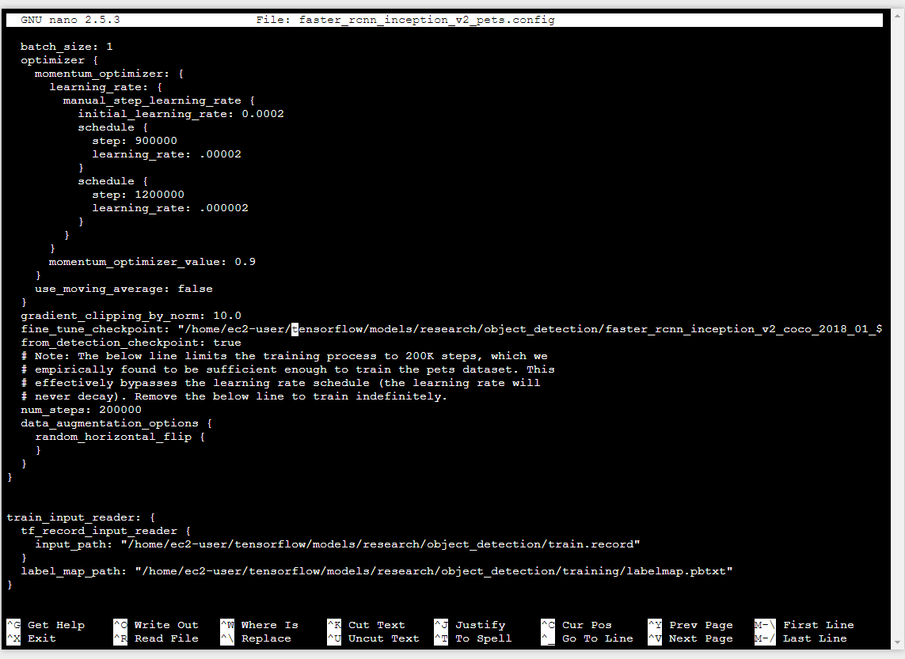
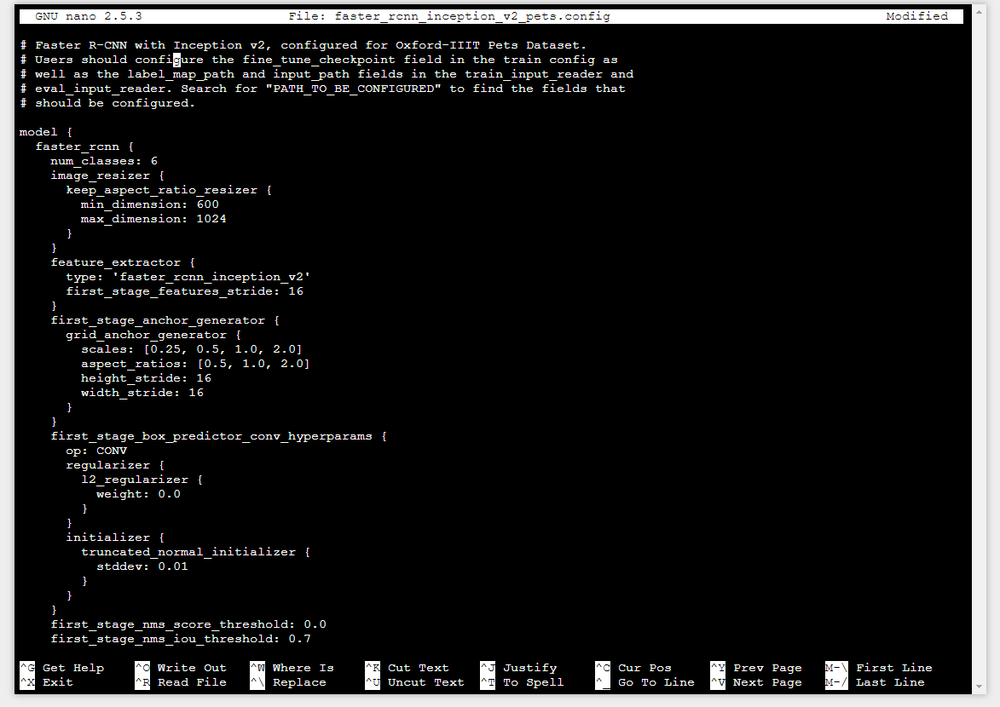
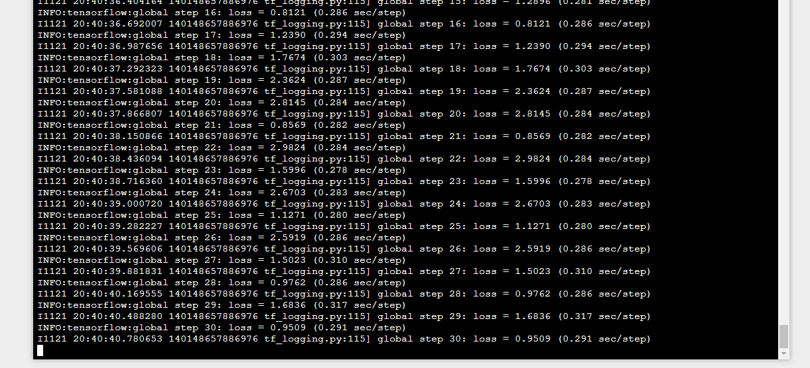

# How to use nvidia-docker image for tensorflow object detection api training on AWS EC2 instance

## Brief summary

This is a tutorial and trail to deploy an training work on AWS EC2 instance. The tutorial include how to set up tensorflow environment, download public training dataset and export inference graph for serving. 

## Choose EC2 or SageMaker instance

Since we want to leverage GPU resource in AWS we need to provision an instance with GPU attched. I suggest to use "Deep Learning AMI (Ubuntu) Version 18.0-ami-0010aba6944e97f9b" since the nvidia-docker, CUDA and CUDNN drivers are all pre-installed in this AMI. This is also the AMI that sageMaker instance used. To use GPU resource, you need to select 'p2' for instance type. 

Once provisioned the EC2 instance, you can type the following command lines to set up the Dockerfile.

```bash
sudo su
yum update
yum upgrade
mkdir -p test/model
cd test/model
nano Dockerfile 
# Test nvidia-smi with the latest official CUDA image
docker run --runtime=nvidia --rm nvidia/cuda:9.0-base nvidia-smi
```
## Dockerfile

Before writting Dockerfile, we need to check the CUDA and cudnn version. Type the following code to find driver version and find corresponding docker image from cuda docker hub. Replace version number in Dockerfile
https://hub.docker.com/r/nvidia/cuda/

```bash
# check cuda version: 
nvcc --version
# Check cudnn version: 
cat /usr/local/cuda/include/cudnn.h | grep CUDNN_MAJOR -A 2
# or 
cat /usr/include/x86_64-linux-gnu/cudnn_v*.h | grep CUDNN_MAJOR -A 2

```

Copy and paste the following code into Dockerfile. This script set up the environment and download tensorflow object detection API.

```Dockerfile
FROM nvidia/cuda:9.0-cudnn7-devel-ubuntu16.04
RUN apt-get update && yes | apt-get upgrade
RUN mkdir -p /tensorflow/models
RUN apt-get install -y git python-pip
RUN apt-get install -y protobuf-compiler \
                       python-pil \
                       python-lxml \
                       wget \
                       unzip \
                       nano
RUN pip install --upgrade pip
RUN pip install \
        tensorflow-gpu \
        Cython \
        contextlib2 \ 
        pandas \ 
        matplotlib \ 
        jupyter 

RUN git clone https://github.com/tensorflow/models.git /tensorflow/models
WORKDIR /tensorflow/models/research
RUN wget -O protobuf.zip https://github.com/google/protobuf/releases/download/v3.0.0/protoc-3.0.0-linux-x86_64.zip
RUN unzip protobuf.zip
RUN ./bin/protoc object_detection/protos/*.proto --python_out=.
ENV     PYTHONPATH $PYTHONPATH:/opt/tensorflow-models/research:/opt/tensorflow-models/research/slim

```
## Build docker image

Use nvidia-docker command to build a docker image called tf-od. If successfully built the image, you can type `docker images` to see if the docker image with name 'tf-od' is listed.

```bash
nvidia-docker build --tag tf-od .
```

if the building process is failed, you can use the following command to delete image
```bash
docker kill $(docker ps -a -q)
docker rm $(docker ps -a -q)
docker rmi $(docker images -q)
```

## Start docker container
Run the docker image to generate a container
```bash
nvidia-docker run -it tf-od
```

export path and test the installation. 
```bash
# From tensorflow/models/rsearch
export PYTHONPATH=$PYTHONPATH:`pwd`:`pwd`/slim
python object_detection/builders/model_builder_test.py
```
if you see "Ran 22 tests in X.XXXs \n OK". That means your environment is ready. 


## Download pretrained model and public training data

The following command will download a pre-trained model "faster_rcnn_inception_v2_coco_2018_01_28" and public dataset to demonstrate how to train a od model. You can download other models from [model zoo](https://github.com/tensorflow/models/blob/master/research/object_detection/g3doc/detection_model_zoo.md)
 and unzip it into a training "folder" update files. Then update  “training\faster_rcnn_resnet101.coco_11_06_2017.config” file to your own local path and adjust parameters if needed 


```bash
# From tensorflow/models/rsearch/object_detection
wget http://download.tensorflow.org/models/object_detection/faster_rcnn_inception_v2_coco_2018_01_28.tar.gz
tar -xvzf faster_rcnn_inception_v2_coco_2018_01_28.tar.gz
rm faster_rcnn_inception_v2_coco_2018_01_28.tar.gz
git clone https://github.com/larui529/tensowflow-od-aws-ec2.git
cp -r tensowflow-od-aws-ec2/* .
rm -f -R tensowflow-od-aws-ec2
```
## Generate tfrecord files

If you want to train your own model, you have to do the cropping to generate labels. I recommand to do it using method shown in [this](https://github.com/EdjeElectronics/TensorFlow-Object-Detection-API-Tutorial-Train-Multiple-Objects-Windows-10) github but you can write your own script to generate the labels. And the labels should looks like the following image before converting to tfrecord files. 


With the images labeled, it’s time to generate the TFRecords that serve as input data to the TensorFlow training model. in the tutorial github the author uses the xml_to_csv.py and generate_tfrecord.py scripts from Dat Tran’s Raccoon Detector dataset, with some slight modifications to work with directory structure.

Next, open the generate_tfrecord.py fil. Replace the label map starting at line 31 with your own label map, where each object is assigned an ID number. This same number assignment will be used when configuring the labelmap.pbtxt file.

For example, say you are training a classifier to detect basketballs, shirts, and shoes. You will replace the following code in generate_tfrecord.py:

```
# TO-DO replace this with label map
def class_text_to_int(row_label):
    if row_label == 'nine':
        return 1
    elif row_label == 'ten':
        return 2
    elif row_label == 'jack':
        return 3
    elif row_label == 'queen':
        return 4
    elif row_label == 'king':
        return 5
    elif row_label == 'ace':
        return 6
    else:
        return None
```

```
# TO-DO replace this with label map
def class_text_to_int(row_label):
    if row_label == 'basketball':
        return 1
    elif row_label == 'shirt':
        return 2
    elif row_label == 'shoe':
        return 3
    else:
        return None
```

Then, generate the TFRecord files by issuing these commands from the /object_detection folder:

```bash
# From tensorflow/models/research/object_detection
chmod -R 777 ~/tensorflow/*
python generate_tfrecord.py --csv_input=images/train_labels.csv --image_dir=images/train/ --output_path=train.record
python generate_tfrecord.py --csv_input=images/test_labels.csv --image_dir=images/test --output_path=test.record
```
## Create Label map
The label map tells the trainer what each object is by defining a mapping of class names to class ID numbers. Use a text editor to create a new file and save it as labelmap.pbtxt in the /tensorflow/models/research/object_detection/training folder. (Make sure the file type is .pbtxt, not .txt !) In the text editor, copy or type in the label map in the format below (the example below is the label map for our Pinochle Deck Card Detector):

```
item {
  id: 1
  name: 'nine'
}

item {
  id: 2
  name: 'ten'
}

item {
  id: 3
  name: 'jack'
}

item {
  id: 4
  name: 'queen'
}

item {
  id: 5
  name: 'king'
}

item {
  id: 6
  name: 'ace'
}
```

The label map ID numbers should be the same as what is defined in the generate_tfrecord.py file. For the basketball, shirt, and shoe detector example mentioned in Step 4, the labelmap.pbtxt file will look like:
```
item {
  id: 1
  name: 'basketball'
}

item {
  id: 2
  name: 'shirt'
}

item {
  id: 3
  name: 'shoe'
}
```

## Change path in configuration file 

Finally, the object detection training pipeline must be configured. It defines which model and what parameters will be used for training. This is the last step before running training!

1. open training/faster_rcnn_inception_v2_pets.config

2. delete /home/ec2-user/ in front of tensorflow(5 places. search (F6) tensorflow)


3. change the "number_classes" to your own number



 ## Training

Here we go! From the /object_detection directory, issue the following command to begin training:
```bash
# From tensorflow/models/research/object_detection
python legacy/train.py --logtostderr --train_dir=training/ --pipeline_config_path=training/faster_rcnn_inception_v2_pets.config
```
3. change the "number_classes" to your own number


You can quit training by press "

## Quit training and export inference graph

Now that training is complete, the last step is to generate export inference graph. There are two ways to generate saved model. One with unfrozen layer and one without. You can follow [this](https://github.com/larui529/tensorflow-object-detection-docker) github to unfreeze and export tensorflow inference graph. For testing, you can use the following code to test exporting inference graph on our trained model. The inference graph exported in this method is unfrozen. 

```bash
# From tensorflow/models/research/object_detection
python export_inference_graph.py --input_type image_tensor --pipeline_config_path training/faster_rcnn_inception_v2_pets.config --trained_checkpoint_prefix training/model.ckpt-XXXX --output_directory inference_graph # you have to change "XXXX" to the step number from the checkpoint file.
```
